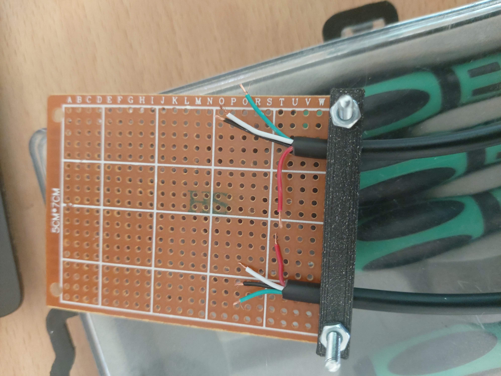
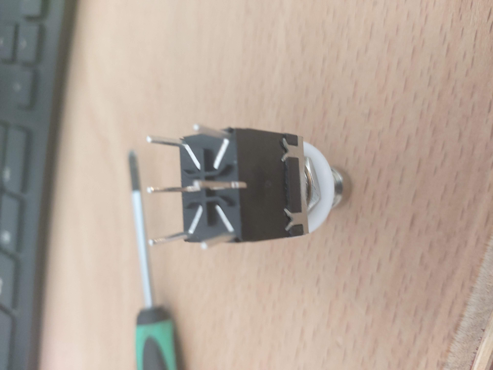
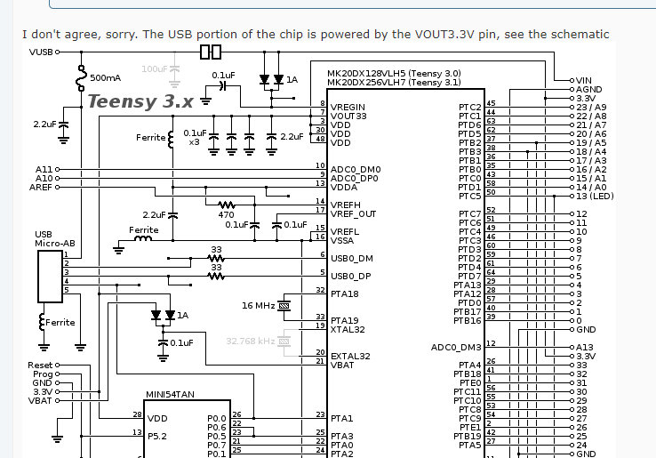

This strain relief bar has 2.75mm holes (which are threaded by M2.5 screws.)
The holes are 40.8mm apart to match short side of perf board

What about the micro usb wire colours?

Red     Ground

Black   D+

White   VCC

Green   D-

Not trusting the breakout board entirely,
I just put a battery pack on the socket end and did indeed get +5V from White to Red!

The switch is two 3 terminal switches.
Along each long side are three legs, A,B,C
B is the common terminal, switching between AB and BC.

I plan to put ground on one side and 5V on the other.

My question was can I just run 5v into the teensie via the microUSB connector and tap off the Vin pin to power all my 13 hall effects boards (26 LEDS!)

Looks like the answer is no, as I'm guessing the wavy line between the micro usb pins and VUSBin is some sort of fuse.

So, I will need to tap off the switch board another 5V source.