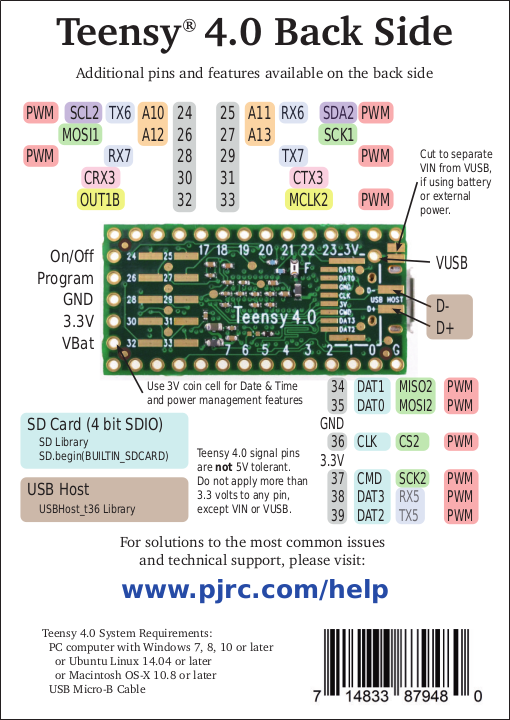

I've just started looking at the teensie 4.0

It has 14 analog pins, but 4 of them are on the rear of the board, not accessed via holes.

I'm going to want access to pins 24-27.

There is a discussion of how to do this here:
https://forum.pjrc.com/threads/59817-Teensy-4-0-accesing-24-to-33-pines?highlight=pogo

I have ordered https://www.sparkfun.com/products/13925 this pin header set via ebay.

In the mean time I want to research two components:

KY-024 Hall Effect breakout.

https://arduinomodules.info/ky-024-linear-magnetic-hall-module/

Wired up to the nano using 3v power. Using arduino serial plot. The flat side of the package seems to be where you want to position the magnet for best reading/range.

These seem really easy, so I've ordered a stack of these. Need to think about a 3d holder.

KY-016 RGB Full Colour LED.

https://arduinomodules.info/ky-016-rgb-full-color-led-module/

