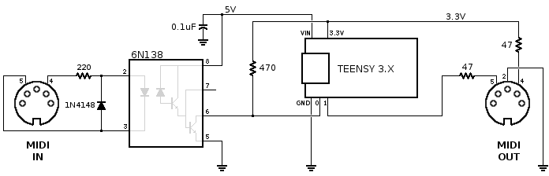
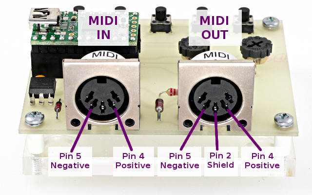

I've just started looking at the teensie 4.0

It has 14 analog pins, but 4 of them are on the rear of the board, not accessed via holes.

I'm going to want access to pins 24-27.

There is a discussion of how to do this here:
https://forum.pjrc.com/threads/59817-Teensy-4-0-accesing-24-to-33-pines?highlight=pogo

I have ordered https://www.sparkfun.com/products/13925 this pin header set via ebay.

In the mean time I want to research two components:

KY-024 Hall Effect breakout.

https://arduinomodules.info/ky-024-linear-magnetic-hall-module/

Wired up to the nano using 3v power. Using arduino serial plot. The flat side of the package seems to be where you want to position the magnet for best reading/range.

These seem really easy, so I've ordered a stack of these. Need to think about a 3d holder.

KY-016 RGB Full Colour LED.

https://arduinomodules.info/ky-016-rgb-full-color-led-module/

Teensie Midi

https://www.pjrc.com/teensy/td_libs_MIDI.html

MIDI uses the hardware serial ports to communicate with standard MIDI devices at 31250 baud.
This page documents ordinary serial MIDI which uses round 5-pin DIN connectors.
You can use Serial.print() to observe what your program is doing, while using MIDI, or USB MIDI.

MIDI input requires an optically isolated input. Output requires only 2 resistors. This schematic is recommended for Teensy 4.x & 3.x & LC:

When connecting the signals on the 5 pin DIN connectors, be sure to connect to the correct pins.

So, let's see if I understand this:

47 ohm resistors

GND wire to pin 2 
Pin 1 is TX1 via 50ohm resistor to send - pin 5 on DIN
3.3V wire via 50ohm resistor to pin 4 (positive)

I've arranged the 3 pin headers in an L-shape
[1][2]
   [3]

[1] = rx/1 din pin 5 orange
[2] = 3.3v din pin 4 green
[3] = gnd  din pin 2 yellow

[orange][green ]
        [yellow]

https://forum.pjrc.com/threads/61941-Exponential-Moving-Average-How-does-it-work

6.5ma = 85ma

Most 3mm LEDs will be rated 20mA maximum, so 30mA is possibly bad for them.  Modern hyperbright LEDs need a lot less than 20mA to be
bright enough for indoor use...  Perhaps your 3mm LEDs are only superbright or ultrabright? (Actually I can't remember which of
these ghastly marketing terms is supposed to be the brightest!).

As LEDs evolved from the first primitive red GaAs LEDs the brightness was improved a 1000 times or more, so there are lots of different
brightnesses available depending on the process used.  The datasheet will normally say what the luminous intensity, beam angle and
luminous flux are for a given forward current.  Just beam angle can have massive effect on luminous intensity.

These days properly bright LEDs use heterojunction/quantum well design similar to semiconductor lasers, and are getting pretty close to
100% quantum efficiency.

1--5mA is normally plenty for a modern indicator LED.  The smaller the LED the less current you need for it to hurt your eyes!

## 14th Sept 2020 ##

I've printed KeyMechRig05.stl and KeyMech02.par
Changes required.
Spring needs to mount parallel betwee rear arm and rear fixing. Needs more stretch at rest 2-3mm
Could change mounting position to print without support if it only pulled on one side of the rear post.

Board mount for sensor is higher than before. Lower by ~2 mm
Board still tends to twist. Add bar at rear and tabs at front,

Cannot tap screws into central screw holes. Not enough clearance.
Front and rear screw holes are a bit close to the front surfaces.

How to wire FC16P

## Start again ##

I wired up all the analog pins incorrectly - I mirrored the pin placement and wired them up to the digital pins on the wrong edge of the teensy.

Doh.

Thankfull I was able to remove the teensie from the protoboard and start again.

My on/off switches arrived today. They have an internal resistor for the LED.

They draw about 1ma at 3.3V.
If I connect black to gnd and brown to 3.3 then the LED lights up when the teensy is on.
If I wire yellow to gnd and orange to on/off - then a long hold turns off the teensie (this turns off 3.3V but not 5V) so the LED goes off. A short press turns it back on.
Can I reduce the number of wires to 3? I've asked the forum because I am not sure.